# Home Network Monitoring

Monitor your home network devices using Prometheus, Grafana, and Blackbox Exporter.

## Features

- 🏠 **Device Monitoring** - Ping monitoring for all network devices
- 📊 **Latency Tracking** - Real-time latency graphs
- ✅ **Uptime Monitoring** - Track device availability
- 🌐 **Internet Connectivity** - Monitor connection to external DNS

## Data Flow Diagram

```mermaid
flowchart LR
    subgraph Network["🌐 Network Devices"]
        Router["🏠 Router<br/>192.168.0.1"]
        Devices["📱 Connected Devices<br/>192.168.0.x"]
        Internet["☁️ Internet<br/>8.8.8.8 / 1.1.1.1"]
    end

    subgraph Docker["🐳 Docker Monitoring Stack"]
        BB["📡 Blackbox Exporter<br/>:9115"]
        Prom["📊 Prometheus<br/>:9091"]
        Graf["📈 Grafana<br/>:3001"]
    end

    subgraph User["👤 User"]
        Browser["🖥️ Dashboard"]
    end

    %% Data Flow
    BB -->|"ICMP Ping"| Router
    BB -->|"ICMP Ping"| Devices
    BB -->|"ICMP Ping"| Internet
    
    Router -->|"Response + Latency"| BB
    Devices -->|"Response + Latency"| BB
    Internet -->|"Response + Latency"| BB
    
    Prom -->|"Scrape /probe<br/>every 15s"| BB
    BB -->|"Metrics:<br/>probe_success<br/>probe_duration"| Prom
    
    Graf -->|"PromQL Queries"| Prom
    Prom -->|"Time Series Data"| Graf
    
    Graf -->|"Dashboards"| Browser
```



### Flow Explanation

| Step | From | To | Description |
|------|------|-----|-------------|
| 1 | Blackbox Exporter | Network Devices | Sends ICMP ping probes |
| 2 | Network Devices | Blackbox Exporter | Returns ping response with latency |
| 3 | Prometheus | Blackbox Exporter | Scrapes `/probe` endpoint every 15s |
| 4 | Blackbox Exporter | Prometheus | Provides metrics (success, duration) |
| 5 | Grafana | Prometheus | Queries metrics using PromQL |
| 6 | Prometheus | Grafana | Returns time-series data |
| 7 | Grafana | User | Displays interactive dashboards |

## Quick Start

```bash
# Start the monitoring stack
docker compose up -d

# Access Grafana
open http://localhost:3001
# Login: admin / admin
```

## Services

| Service | Port | Description |
|---------|------|-------------|
| Grafana | 3001 | Dashboards & Visualization |
| Prometheus | 9091 | Metrics Storage |
| Blackbox Exporter | 9115 | ICMP/HTTP Probing |

## Adding Devices

Edit `prometheus/prometheus.yml` and add device IPs to the `blackbox-icmp` targets:

```yaml
- targets:
    - 192.168.0.1    # Router
    - 192.168.0.100  # New device
```

Then restart Prometheus:
```bash
docker restart home-prometheus
```

## Project Structure

```
├── docker-compose.yml
├── prometheus/
│   └── prometheus.yml
├── blackbox-exporter/
│   └── blackbox.yml
└── grafana/
    ├── dashboards/
    └── provisioning/
```
## Dashboard
